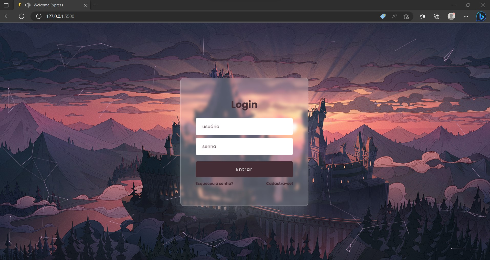

<h1 align="center">Página de Login</h1>

O #boraCodar é um evento exclusivo e gratuito, promovido pela Rocketseat para ensino de tecnologias WEB. Onde toda semana é lançado um novo projeto, para te desafiar a evoluir suas técnicas. 

  <a href="#-tecnologias">Tecnologias</a>&nbsp;&nbsp;&nbsp;|&nbsp;&nbsp;&nbsp;
  <a href="#-projeto">Projeto</a>&nbsp;&nbsp;&nbsp;|&nbsp;&nbsp;&nbsp;
  <a href="#-layout">Layout</a>&nbsp;&nbsp;&nbsp;|&nbsp;&nbsp;&nbsp;
  <a href="#memo-licença">Licença</a>

  

 

  

 

## 🚀 Tecnologias

Esse projeto foi desenvolvido com as seguintes tecnologias:

- HTML e CSS
- JavaScript
- Figma

 
## 💻 Projeto

Desenvolver uma página de login, que tenha verificação nos campos de usuário e senha ao tentar logar na aplicação. Caso o dados não sejam passados corretamente, o sistema deve alertar para corrigir o dado. Para animar a tela, foi utilizada a biblioteca particles.js .

- [Visite o projeto](https://wilkasantos.github.io/desafioBoraCodar-login/)

 
## 🔖 Layout

O layout do projeto encontra-se no Figma e você pode ter acesso através [DESSE LINK](https://www.figma.com/community/file/1217810469465160264/%23boracodar---Desafio-11).

 
## 🔒 Layout

Esse projeto está sob a licença MIT.
